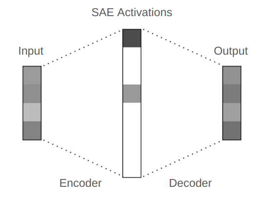

# Auto-encoders
Exploration of how auto-encoders work and how they can be applied.

## SAE (Sparse-Auto-Encoders)

### sparse-auto-encoders.ipynb is an example of a simple sparse-auto-encoder

### SAE_TF-IDF.ipynb is an example of a use case of a SAE applied to TF-IDF
